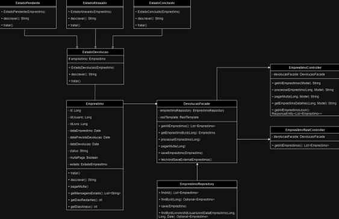

# 📚 Microserviço de Devolução de Livros

Projeto desenvolvido como parte de uma atividade acadêmica, com foco na aplicação de padrões de projeto (GoF) em arquitetura de microsserviços.

Este microserviço é responsável pela funcionalidade de devolução de livros em um sistema de biblioteca.

## Funcionalidades

- Processamento de devoluções
- Cálculo de multas por atraso
- Atualização de status de empréstimo

## Padrões de Projeto Aplicados

- **State**.
- **Strategy**.
- **Observer**.
- **Facade**.

## 📊 Diagrama de Classes

## Tecnologias

- Java
- Spring Boot
- Maven

